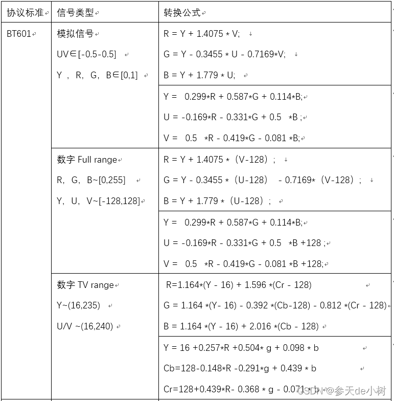
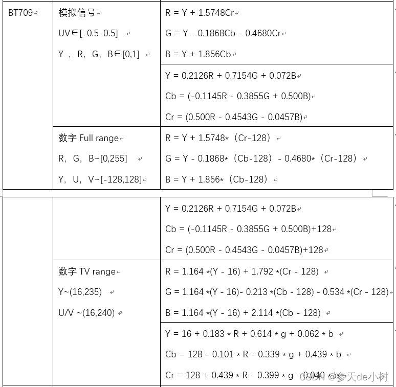
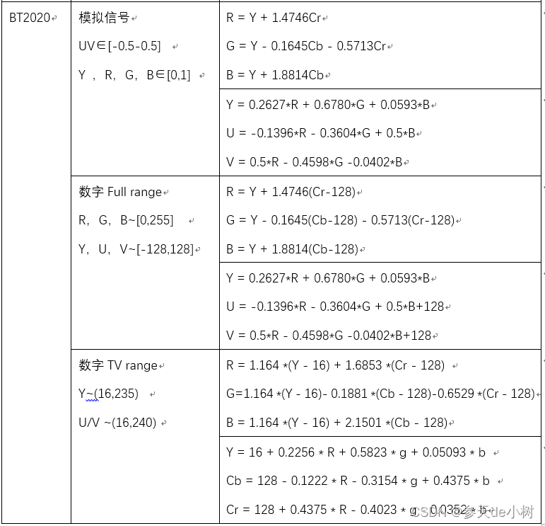

# V4L2VideoProcess
这是一个使用V4L2(Video for Linux two)的数据结构和接口，旨在完成Linux系统下 **视频采集处理模块** 功能封装的Qt项目。

## 概述
V4L2是Linux环境下开发视频采集设备驱动程序的一套规范(API)，可用于图片、视频和音频数据的采集。它为驱动程序的编写以及应用程序的访问提供统一的接口，并将所有的视频采集设备的驱动程序都纳入其的管理之中。不仅给驱动程序编写者带来极大的方便，同时也方便了应用程序的编写和移植。在远程会议、可视电话、视频监控系统和嵌入式多媒体终端中都有广泛的应用。（V4L2功能可在Linux内核编译阶段配置，默认情况下都有此开发接口）。  
V4L2规范中不仅定义了通用API元素，图像的格式，输入/输出方法，还定义了Linux内核驱动处理视频信息的一系列接口(Interfaces)，这些接口主要有：  
```
视频采集接口——Video Capture Interface;(V4L2最常用的接口)
视频输出接口—— Video Output Interface;
视频覆盖/预览接口——Video Overlay Interface;
视频输出覆盖接口——Video Output Overlay Interface;
编解码接口——Codec Interface。
```
## 1.视频采集模块
### 1.1.采集流程
1. 打开视频设备文件，检查设备信息，设置采集数据的参数和格式，比如采集帧的帧率、帧格式、采集模式等;
2. 申请若干视频采集的帧缓冲区，并将这些帧缓冲区从内核空间映射到用户空间，便于应用程序读取/处理视频数据;
3. 将申请到的帧缓冲区在视频采集输入队列排队，并启动视频采集;
4. 驱动开始视频数据的采集，应用程序从视频采集输出队列取出帧缓冲区，处理完后，将帧缓冲区重新放入视频采集输入队列，循环往复采集连续的视频数据;
5. 停止视频采集。

### 1.2.帧格式转换(YUV--RGB)
在计算机视觉系统中，图像的显示往往涉及到颜色空间转换的问题，目前广泛采用的数字图像传感器和模拟图像传感器的数据输出格式一般都包含YUV(YCbCr)，而显示器驱动以及图像处理往往都是采用RGB值，所以就需要YUV--RGB帧格式的转换。  
#### 1.2.1.YUV详解
YUV，分为三个分量，“Y”表示明亮度，也就是灰度值；而“U”和“V” 表示的则是色度，作用是描述影像色彩及饱和度，用于指定像素的颜色。YCbCr是YUV通过缩放和偏移衍变而成的，Cb、Cr同样指色彩(红蓝色差分量)，只是表示方法不同，一般情况下YUV和YCbCr被认为是相同的。  
与RGB类似，YUV也是一种颜色编码方法。它的存储格式有两大类：平面planar(先连续存储所有像素点的Y，紧接着存储所有像素点的U，随后是所有像素点的V)格式和打包packed(每个像素点的Y,U,V是连续交叉存储的)格式。而在这两大类之下根据采样方式(Y U V采样频率比例)又分为YUV444、YUV422、YUV420等等。  
```
YUV 4:4:4采样，该格式亮度和色度的采样比例相同，每一个Y对应一组UV分量，但同时传输的数据量也最大，所以在视频采集时不太常用。
YUV 4:2:2采样，该格式亮度和色度采样比例2:1，每两个Y共用一组UV分量，常见的YUYV(YUY2)、UYVY，YUV422P(planar)都属于该格式。
YUV 4:2:0采样，该格式亮度和色度采样比例4:1，每四个Y共用一组UV分量，常见的NV12、NV21都属于该格式。
```
注:有关更多的YUV格式及采样情况，请自行上网搜索，另外在document/v4l2.pdf(v4l2 API说明书)文档内也提供了一些常见yuv格式采样的字节顺序。
#### 1.2.2.YUV--RGB转换公式
网上关于YUV--RGB的转换公式有好多种，而且有些差别很大，但那些公式基本都是对的，只不过是采用的是不同的标准(BT601/BT709/BT2020)，以及同一种标准下又区分不同的range(各分量的定义域)。  
BT601主要是针对SDTV的标清视频(480i)定义的标准,BT709主要是针对HDTV(720P及以上)的高清视频，相对较新，使用也比较广泛。二者在转换公式上本质的区别就是转换系数不同，所以如果转换标准不匹配可能就会出现色彩偏差或失真的情况。BT2020是针对超高清的视频，目前用的还比较少。  
上面提到即便是同一种标准，又区分不同的range，导致转换公式依然不同。当yuv作为模拟信号时，range是(Y∈[0,1] U,V∈[-0.5,0.5])，而当用作数字信号时，range分为TV range(Y~[16,235] Cb~[16-240] Cr~[16-240]，量化范围)和Full range(各分量范围0-255，未量化范围)。  
不同标准不同range有不同的转换公式如下图  
  

  

目前代码中软解码方案使用的转换标准为BT601(Full range):
```
yuv<---->rgb格式转换常用公式(CCIR BT601)：
注:下述公式yuv和rgb值区间均为[0,255]
浮点计算(效率低) 
R=Y+1.403*(V−128)
G=Y–0.343*(U–128)–0.714*(V–128)
B=Y+1.770*(U–128)

Y=0.299R+0.587G+0.114B
U(Cb)=−0.169R−0.331G+0.500B+128
V(Cr)=0.500R−0.419G−0.081B+128
整形移位:(效率较高)
v=V-128; u=U-128;
R=Y+v+((103*v)>>8)
G=Y-((88*u)>>8)-((183*v)>>8)
B=Y+u+((197*u)>>8)
```
### 1.3.代码功能及接口  
#### 1.3.1.模块功能
1.采集模块代码由V4L2Capture类实现，内部封装V4L2的相关接口，采集到的原始帧数据如果配置了需要软解码成RGB，则会通过ColorToRgb24类提供的静态函数(目前支持V4L2_PIX_FMT_YUYV、V4L2_PIX_FMT_NV12、V4L2_PIX_FMT_NV21三种yuv格式到rgb24的转换处理，使用整形移位法提高性能)在cpu中完成软解码，将yuv等格式数据转换成rgb24传递给外部使用。如果配置需要原始帧数据，也会将原始数据传递给外部使用(通过GPU解码渲染)。    
2.该模块使用V4L2的标准流程和接口采集视频帧，使用mmap内存映射的方式实现从内核空间取帧数据到用户空间。  
3.该模块提供两种取帧方式：一种是在类外定时调用指定接口(ioctlDequeueBuffers)取帧，可以自由控制软件的取帧频次，不过有些设备驱动当取帧频次小于硬件帧率时，显示会异常;另一种是采用select机制自动取帧，该方式在处理性能跟得上的情况下，取帧速率跟帧率一致，每取完一帧数据以信号的形式对外发送。要使用该方式只需在类构造函数中传递useSelect=true参数，内部会自动创建子线程自动完成取帧处理，外部只需绑定相关信号即可。  
#### 1.3.2.代码接口  
```
    //设备操作
    bool openDevice(const char *filename,bool isNonblock);//打开设备
    void closeDevice();//关闭设备
    bool resetDevice();//重置设备

    //打印设备信息(用于调试使用)
    void printDeviceInfo();
    //设置视频流数据
    void ioctlSetInput(int inputIndex);//设置当前设备输入
    void ioctlSetStreamParm(uint captureMode,uint timeperframe=30);//设置视频流参数
    void ioctlSetStreamFmt(uint pixelformat,uint width,uint height);//设置视频流格式
    //初始化帧缓冲区
    bool ioctlRequestMmapBuffers();//申请并映射视频帧缓冲区到用户空间内存
    //帧采集控制
    void ioctlSetStreamSwitch(bool on);//启动/停止视频帧采集
    bool ioctlDequeueBuffers(uchar *rgb24FrameAddr,uchar *originFrameAddr[]=NULL);//从输出队列取缓冲帧

signals:
    //向外发射采集到的帧数据信号
    void captureOriginFrameSig(uchar **originFrame);//原始数据帧(pixelFormat,二维长度针对多平面类型的数量，单平面为1)
    void captureRgb24FrameSig(uchar *rgb24Frame);//转换后的rgb24数据帧，外部可通过QImage进行处理(镜像等)显示

    //外部调用，用于触发selectCaptureSlot()槽在子线程中执行
    void selectCaptureSig(bool needRgb24Frame,bool needOriginFrame);
    
```
## 2.视频渲染模块
该项目提供两种渲染视频帧的方式，一种是需要先cpu软解码生成rgb24数据，将rgb24数据封装成QImage，传递给PixmapWidget部件显示。第二种是直接将yuv原生数据传递给OpenGLWidget部件，内部通过V4l2Rendering调用Opengl接口由硬解码转成rgb数据后渲染。相比较而言，第二种完全的硬解码渲染处理性能更高，但前提需要硬件GPU支持。
### 2.1.PixmapWidget渲染
该组件核心是通过paintevent绘制pixmap，提供一个宏USE_OPENGL_WIDGET决定采用cpu绘制还是gpu绘制。即先通过cpu软解码生成rgb24的数据，然后通过该控件调用paintevent绘制。只不过当启用USE_OPENGL_WIDGET宏定义时，该部件继承自QOpenGLWidget，paintevent内部的绘制渲染处理会自动通过gpu加速完成。
```
//传递pixmap
void setPixmap(const QPixmap &pixmap);
```
### 2.2.OpenGLWidget渲染
该组件的核心是通过封装的V4l2Rendering类对象调用opengl的api接口，通过着色器实现GPU硬解码渲染。  
OpenGLWidget继承自QOpenGLWidget组件，目的是作为一个可视化组件显示渲染图像，而V4l2Rendering继承自QOpenGLExtraFunctions，内部封装了opengl的api接口，用于调用完成opengl的相关操作。组件构造函数有一些必要的参数(帧格式、帧宽高、TV Range标识)需要传递，内部V4l2Rendering基于这些参数自动完成Opengl的初始化流程与着色器的设置。另外还提供了对图像的镜像和基础颜色调整的接口。关于帧格式这里借用V4L2的帧格式宏定义，便于与采集模块对应，目前内部封装了(V4L2_PIX_FMT_YUYV、V4L2_PIX_FMT_YVYU、V4L2_PIX_FMT_NV12、V4L2_PIX_FMT_NV21、V4L2_PIX_FMT_YUV420、V4L2_PIX_FMT_YVU420)六种格式的处理。兼容了yuv422、yuv420p、yuv420sp等不同格式的处理，如有新的格式需求可参考已有的代码和着色器，添加对应的解析处理即可。  

在编写该组件时遇到的坑比较多，包括但不限于OpenGL和OpenGL ES的版本在纹理采样通道格式上的区别，纹理通道绑定的调用次序，以及GLSL版本不同着色器的语法兼容性，纹理数据解包字节对齐方式对画面的影响等等，目前遇到的坑都已经填好了，细节参见代码，但可能还有些隐藏坑未被发现，但鉴于时间问题，该渲染组件暂时先告一段落，等以后有时间再来优化。

## 参考资料
1. [嵌入式LINUX环境下视频采集知识(V4L2)](http://blog.chinaunix.net/uid-11765716-id-2855735.html)  
2. [和菜鸟一起学linux之V4L2摄像头应用流程](https://blog.csdn.net/eastmoon502136/article/details/8190262)  
3. [嵌入式图像处理算法优化指南之YUV转RGB的高效实现](http://blog.sina.com.cn/s/blog_1368ebb6d0102vujd.html)  
4. [YUV到RGB颜色空间转换算法研究](https://wenku.baidu.com/view/f57562ec04a1b0717fd5ddae.html)  
5. [YUV图解(YUV444, YUV422, YUV420, YV12, NV12, NV21)](https://blog.csdn.net/xjhhjx/article/details/80291465)  
6. [YUV图像格式存储方式(YUV420_NV12、YUV420_NV21、YUV422_YUYV、YUV422_YUY2)](https://blog.csdn.net/u012633319/article/details/95669597)
7. [BT601/BT709/BT2020 YUV2RGB RGB2YUV 公式](https://blog.csdn.net/m18612362926/article/details/127667954)
8. [Qt OpenGL入门教程--图形渲染管线](https://www.bilibili.com/read/cv10421402/)
9. [一口气搞懂所有 YUV 格式图像的 OpenGL 渲染](https://zhuanlan.zhihu.com/p/684644740)
10. [纹理数据对齐方式：GL_UNPACK_ALIGNMENT](https://www.jianshu.com/p/f6f3363cdbf3)
    
项目中遇到了诸多问题，过程中把万能的互联网翻了个底朝天，在这里感谢上述提到的以及由于疏忽未记录的巨人的肩膀，感谢！

## 作者联系方式
**邮箱:justdoit_mqr@163.com**  
